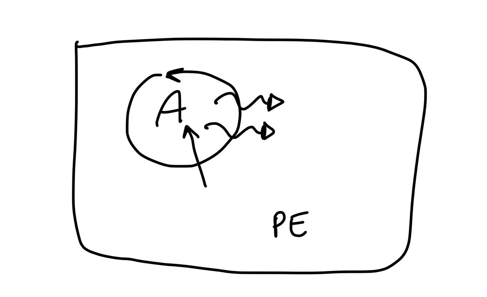
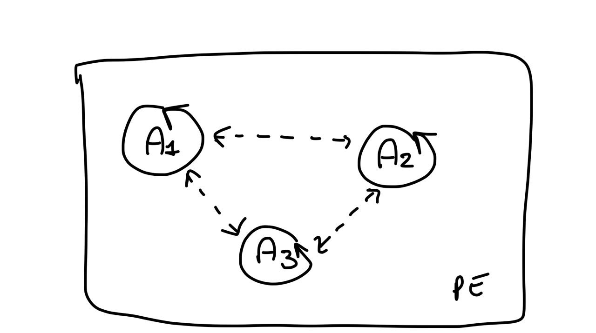
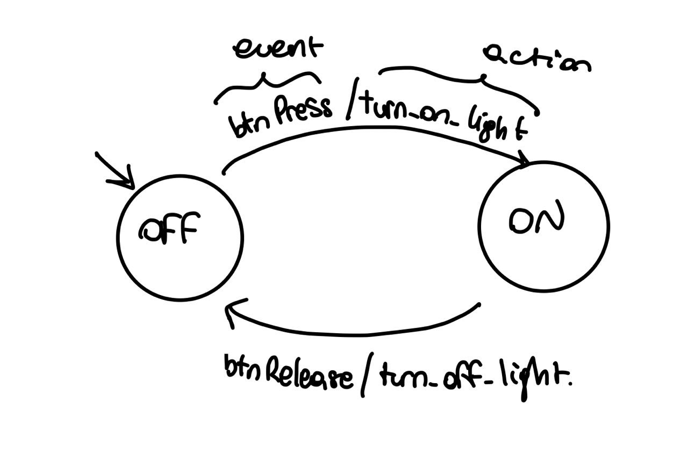
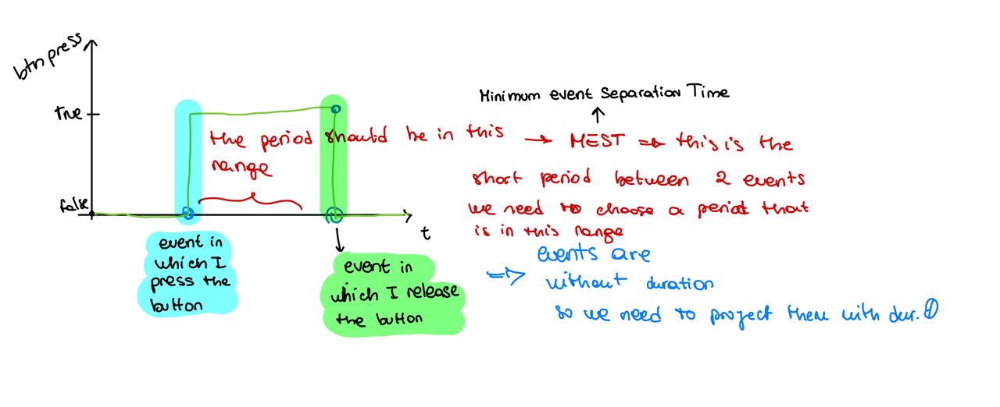

# lab 01
Reactive systems is like a cactus in which we have input and output, but also there is an interaction between systems. this interaction is a core point. The point is how to design reactive systems? remember that systems are inside an environment to which they communicate/ interact

case1 -> centralized system that is controlled from an agent. so a single sw agent that control the single system.
we have an agent that is an active component, that is proactive and reactive, because they need to react to environment event, but also create/computate events or actions

case2 -> distributed system composed by 3 subsystem, that in order to do that job must communicate. for doing that, they use a standard protocol that is MQTT.
in this case we have 3 agents that are reactive and proactive and that communicate with each other in order to perform the goal

(the idea is running 3 different applications that communicate with mqtt (for doing that install mqtt on your pc, by mosquito or vertex)

### Finite state machine

the final state machine is the way for showing the behavior of an agent, we have 2 type of FSM:
- synch -> time triggered
- async -> event triggered 

es the button led (a button and a light and simply when we press the button the light switch to on, when release it, it is turned off), the related FSM is the following:
there is also variable that condition the behavior 
actions can be specified on the transition between states
there is a single content flow (as in case 1 in which there is a single centralized agent)

in the synch case, is defined a period *p*, the event occurs every *p* period, so this is the motivation because it is called **time triggered**. In this case all depends on the time (logical clock of the system). when we use them we need to be aware about the period so this is also the problem of this systems. this because every event has a duration equals to 0, so the period need to be short enough for not loosing events, but at the same time should be as large enough for complete the operation.

we need to abstract from the duration of the computation, but at the same tame we need to consider that computation need some times, so the duration should be large enough for complete the computation. 

in this case the period is very important

in the **event triggered case we have no period**, in this case we need a mechanism in order to model the events.

FSM is a good model for specify the behavior that we want to obtain, so we can use them, but we need also to show the global behavior, but for doing that we have to stay more abstract (example in which we show the 3 agents)

the basic kind of control architecture (what should be the pattern, or the common behavior of these agents) is the **super loop architecture** (sens plan act). Is a general way for describe the general behavior of reactive systems.

in pseudocode there is an initial state in which we made a setup an then there is a loop in which we look at the system, on that we decide what to do and then we act:

SETUP

LOOP: -> this are execution cycles.
    SENS
    DECIDE WHAT TO DO (the decision must be taken on the sens of this cycle, only with atomic operation we can get this type of behavior)
    ACT

all the actions inside the loop must be atomic but at the same time they must be non blocking, because if it is blocking we are blocking the loop, so the system is no more able to sensing the system, so we decompose a task in multiple cycles, so that even if is a long computation we are not blocking the whole system.
if it is only with these instructions the pc is not reactive, for being reactive it needs interruption, interruption are performed at the end of every cycle of the loop, this leads to a event driven behavior. 
the interruption can not interrupt an action that is performing, but at the end of it the pc understand that there was an interruption, so it starts to manage it.

If I have a machine that support a super loop i need only to program what at each loop it needs to do. In the case of agents we haven't a loop, but we program that with plans that specify what to do when something occurs.

the other one is the **EVENT LOOP,** in this case our agents are programmed for managing events, where events can be everything. in this case we have:

LOOP:
    EV <-	WAIT FOR EVENT (this is the only place in which we are waiting)
    H<-SELECT HANDLER(EV)
    EXEC(H)

it can be implemented with different threads. when adopting an event loop we are perceiving the environment only through events. any kind of input generated by the environment, should be modeled in terms of events! (as in case of actors in which everything is model as message).

All the approach are independent of the state.

SUPER LOOP FSM -> in this case we said that every period of time corresponds to a clock cycle (and every cycle depends on the current state )

EVENT LOOP FSM -> we model the tick of each loop through events, in this case the handler that will be executed depends on the triggered event.

For representing an FSM in programs we use the <u>STATE DESIGN PATTERN</u>, in which there is an interface that define at high level the event an than a class for each state of the FSM. these class implements the state interface, and inside the state describe the behavior that the machine has when it is in that state, so the events that can trigger and the state in which arrives when that event is triggered.

--------

### Follow up

another representation for representing a process can be a petri net or a process algebra, this last representation can be also used for checking the property of our process.

An important consideration in pervasive computing is that we are influenced a lot by the environment, so when we design the architecture, in case of the event loop we need to consider the frequencies of the environment events, in fact if it generates lot of events we have to implement some mechanism in order to manage these throughput and also manage the situation when some events are missed. For doing that for example we can consider ignoring all the events that are useless for the application. These considerations are only for the event loop, in fact in case of a super loop we are not considering the events, but each period of time we check the state of the system, so we are less influenced by the operation that are occurring in the environment.

If you want to build a reactive system you have not to block the system, so all the long duration activities must be performed asynchronous. The only point in which we can block the system is in which we are waiting for the events, in case of the event loop. in case of the super loop the though is the same, so each cycle mustn't block the system.

In the distributed case logics is put inside the component that interact directly with the environment, in our case is the light, another solution consists in using another component to which is delegate all the logics of the system. in this last case we are considering completely independent the sensors that communicate with the agent that is in charged to manage and collect the data. If i put the logics in a component i can reuse it, so is better using another component, whose task is only managing the logics of the system, doing that we are modularising the system.

Adding an API above each sensors we are abstracting from the implementation, doing that we can use the sensor in different applications because it is reusable. The API show the functionalities that the component can performs for the other services.

So we need another component, agent (sw component), that is in charged of managing the logics, this component is located or in the network level, still in local (**fog computing**), or on cloud (**cloud computing**). So we can decide between two network level. 

While each agent (service) managing the sensor is located in the device (things), so physically (**edge computing**, because they encapsulate the logics inside the sensor). In this case the computation (proactive behavior) is seen as a service performed by that component. Each service is a passive, reactive component because their API is exposed for other component, but it is also proactive because needs to elaborate data for exposing them by the API. They need also to be asynchronous (so no Remote procedure call) because they must be reactive. Each service MUST expose, so have an API.

Depending on the state that we have we can simplify the check of events that can occur, for example if i'm in the detection state i can simplify checking only for the event about no detection, that move us in the no detection state.

A good architecture is translate in haven't to change everything if i want to change a protocol i haven't to change the architecture.

how we can detect failures in the distributed system? we can perform a mechanism of self check, and when  a system detect a failure, informs the main logic module in order to inform it that there is a failure and it must manage it.

The failure state is a method for also knowing the state of the environment. so we have to put effort also for managing that

// servizio -> modo di modellare il dominio, strettamente legato a LSS. I servizi devono essere modellati, anche nelle loro API per essere descritti a livello di dominio, business
