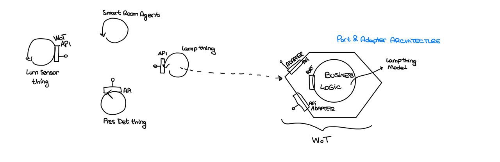
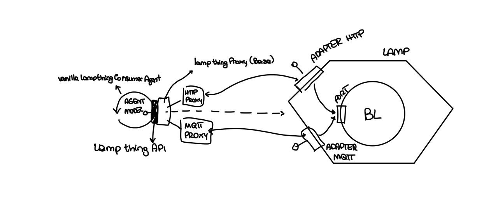
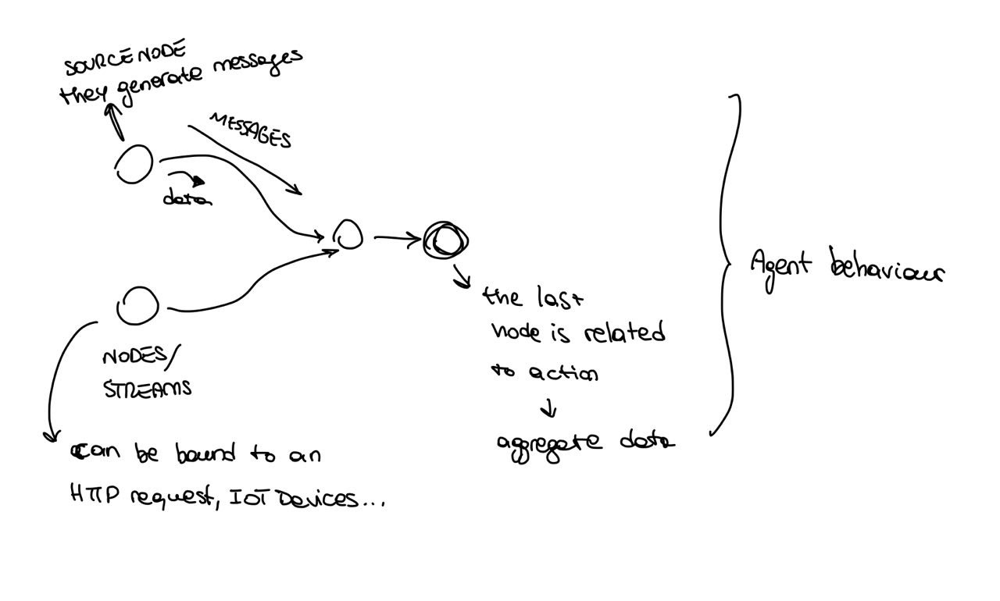

# Lab02 - 05/10/2022

In this case we are trying to adopt a more WoT approach.

We have 3 devices each one expose a wot API . The idea is that we have a separate agent that encapsulate the smart room logics. This agent is going to interact with other agent in order to manage them.

Also in this case the architecture is distributed, so each component is independent from the other.

The important thing is that we are going to adopt a Web of Thing approach, this means that we have that every iot device control a thing, and each thing is provided with a description, according to the W3C.



we can use the ports and adapter (also called hexagonal pattern) architecture. The key point is that the business logics is putted at the center and it should be designed inspite of each technology that can be used. So it is based on the problem domain.

Then we have ports that again are not bound to a specific technology. these ports permit us to communicate with the business logic. Outer from the ports, we have another layer that expose and define the API of the application, so the adapter. these are bounded to specific technology.

(port is the lamp thing API interface)

For the same Business logic we can have different API (adapter), in our example we have an HTTP API and at the same times, an MQTT API. so 2 different adapters, in order to do the same operations from different technologies. In general we have different API not only for different protocols, but also for doing different operations.

Another representation is using node-red, in this case we haven't an agent that coordinate the other, but we are trying to made a mash-up, so finding an orchestration that glued together the component of the system. 

-- CODE -- 

Model is the place in which we are putting the logics of our system (lamp thing model)

Our lamp thing service has 2 adapters, HTTP and MQTT. both adapters goes to the same port, which is represented by the lamp thing API. The adapter should complaint to WoT.

In the model I haven't any dependency from the adapter, but only from the port.

The agent (VanillaLampThingConsumerAgent)  use a proxy that has the responsibility to wrap/represent the API. this is part of the component. It expose an API that is the same of the lamp thing API. This is a base class. we have then 2 different classes: HTTP Proxy and MQTT proxy. Proxy encapsulate the mechanism to interact with the service, so the adapter of the service. the Agent model should independent from the proxy element. This Agent represent the consumer of the service, then it can become another service, but how we had implement it, it is only a consumer.

the Vanilla interface, is asynchronous, this is the reason that it choose Vertx.

An adapter is going to process the requests and call the respective action on the model. The adapter needs a reference of the model object so its API

In our case is the Model that generate the TD (thing description) that is one for each thing (is an instance of the td). in the model we can put only the information according to the core part, not them related to the binding, so the forms are empty. the service needs to get the model and install, so create all the adapters, this populate the forms, so add informations to the thing description. Each adapter is enriching the TD adding all the informations needed to know how discover\find things in the specific protocol that they are representing.

The proxy doesn't have the link to the real model, because it is in the remote side, it just implement it.

### node-red 

in case of node-red is based on flow based programming (reactive programming)

in this case streams are called nodes and hey can generate data. nodes are connected in order to permitts data flowing. nodes are asyncronous



### Notes -Andre

https://docs.google.com/document/d/1d9v65OOI9qKpCA8LDHl839kS5_m_sOMdJ6YU-hlhrH0/edit

LampThingModel -> model the business logic of the lamp. It's model. We are not happy to bound the model to Vertx. But it's not bound to it for HTTP or MQTT but only to support asynchronous programming. If we have a language that would support it then no Vertx.
We need to be able to design the Agent Model without depending on technologies.
The Thing Description here is described without inserting the Forms, because it's not aware of the different adapter that are used. (The forms are inserted by each adapter when requested. So in this way we insert only the information on the protocol that is using the consumer to requesting the td).

LampThingAPI -> in this case we have modeled the API strictly following the Thing Description. 
But if we think we could have modeled a general WoT Java Interface.

````
getProperty(prop)
doAction(action)
getEvents(event)
````

At one side is useful because is reusable. But at the other hand we loose expressiveness in the code -> at the same time the description is in the Thing Description.
Every method is going to be asynchronous. Also, here Vertx is used only because Java asynchronous support. 
The methods are asynchronous in a way to hide a potential complexity under the specific request. In this case each request could be made synchronous.

*Consumer*
This is the consumer of the service (the agent). 
The *VanillaLampThingConsumerAgent* model the *Agent Model*
Then we model the Proxy because we want to be independent from technologies also in the Agent Model. In this way the VanillaLampThingConsumerAgent depend only on the Thing API and not on the Thing Adapter Technologies (in this case HTTP and MQTT).