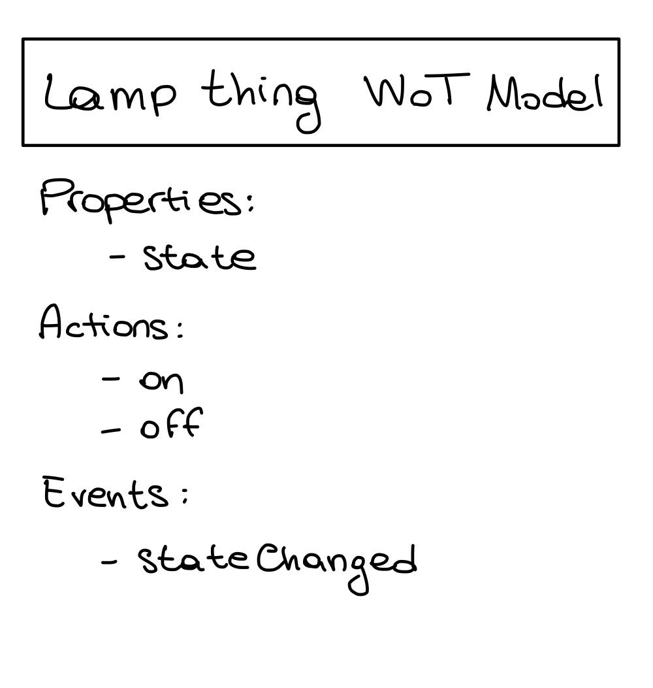
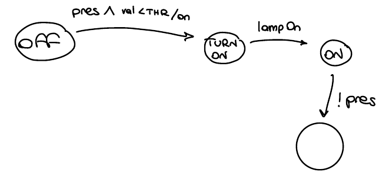

# Lab02 - 05/10/2022

In this case we are trying to adopt a more WoT approach.

We have 3 devices each one expose a wot API . The idea is that we have a separate agent that encapsulate the smart room logics. This agent is going to interact with other agent in order to manage them.

Also in this case the architecture is distributed, so each component is independent from the other.

The important thing is that we are going to adopt a Web of Thing approach, this means that we have that every iot device control a thing, and each thing is provided with a description, according to the W3C.


we can use the ports and adapter (also called hexagonal pattern) architecture. The key point is that the business logics is putted at the center and it should be designed inspite of each technology that can be used. So it is based on the problem domain.

Then we have ports that again are not bound to a specific technology. these ports permit us to communicate with the business logic. Outer from the ports, we have another layer that expose and define the API of the application, so the adapter. these are bounded to specific technology.

As said before, ports are not bound to a specific technology. A port is an interface to request functionalities to the business logic or change its state. Ports are a concept hat are strongly bounded to the business logic. The specific implementations are called ADAPTERS. The interactions are asynchronous, because all of these things are uncoupled by the control point of view.

(port is the lamp thing API interface)

For the same Business logic we can have different API (adapter), in our example we have an HTTP API and at the same times, an MQTT API. so 2 different adapters, in order to do the same operations from different technologies. In general we have different API not only for different protocols, but also for doing different operations.

Another representation is using node-red, in this case we haven't an agent that coordinate the other, but we are trying to made a mash-up, so finding an orchestration that glued together the component of the system. 

-- CODE -- 

Model is the place in which we are putting the logics of our system (lamp thing model)

Our lamp thing service has 2 adapters, HTTP and MQTT. both adapters goes to the same port, which is represented by the lamp thing API. The adapter should complaint to WoT.

The agent will interact with the lamp thing model, exposing the same interface of the lamp thing (the lamp thing API).

In the model I haven't any dependency from the adapter, but only from the port.

The agent (VanillaLampThingConsumerAgent)  use a proxy that has the responsibility to wrap/represent the API. this is part of the component. It expose an API that is the same of the lamp thing API. This is a base class. we have then 2 different classes: HTTP Proxy and MQTT proxy. Proxy encapsulate the mechanism to interact with the service, so the adapter of the service. the Agent model should independent from the proxy element. This Agent represent the consumer of the service, then it can become another service, but how we had implement it, it is only a consumer.

the Vanilla interface, is asynchronous, this is the reason that it choose Vertx.

An adapter is going to process the requests and call the respective action on the model. The adapter needs a reference of the model object so its API

In our case is the Model that generate the TD (thing description) that is one for each thing (is an instance of the td). in the model we can put only the information according to the core part, not them related to the binding, so the forms are empty. the service needs to get the model and install, so create all the adapters, this populate the forms, so add informations to the thing description. Each adapter is enriching the TD adding all the informations needed to know how discover\find things in the specific protocol that they are representing.

The proxy doesn't have the link to the real model, because it is in the remote side, it just implement it.

we can find the thing description in the link: localhost:8888/api



WoT is really based on URI, on the web technologies, like link and forms. For each affordances (offerte) I have a form.

through postman we turned on the light, we did a post request to api/actions/on that called "on"on the model and changed the state on the simulator. An event has been published, generated: if I'm observing the lamp I should receive the notification. The vanilla agent get the state and subscribe on the lamp events. the proxy implements the same interface of the main lamp thing model.

The idea that a service is auto-descriptive in its services helps agents to understand and use components that they have never saw before. Forms enable to perform a post request with pre-compiled and user compiled data.

### node-red 

in case of node-red is based on flow based programming (reactive programming)

in this case streams are called nodes and hey can generate data. nodes are connected in order to permits data flowing. nodes are asynchronous


The key point is that everything is data oriented and asynchronous, messages flow between nodes. These nodes can be bounded by sources of any sort, to any input generating a flow, all in a declarative way.

Typically there is no shared state, only flowing messages.

With node-red we start not coding, but drawing the flows we want to describe: on the left we have the block that represents the different flow kinds, like injecting data. we can have also input data from MQTT or HTTP request, and also through WoT (must be installed as extension package via npm).

Functions operates on flows generating a new flow, or multiple flows.


### Notes2

https://docs.google.com/document/d/1d9v65OOI9qKpCA8LDHl839kS5_m_sOMdJ6YU-hlhrH0/edit

LampThingModel -> model the business logic of the lamp. It's model. We are not happy to bound the model to Vertx. But it's not bound to it for HTTP or MQTT but only to support asynchronous programming. If we have a language that would support it then no Vertx.
We need to be able to design the Agent Model without depending on technologies.
The Thing Description here is described without inserting the Forms, because it's not aware of the different adapter that are used. (The forms are inserted by each adapter when requested. So in this way we insert only the information on the protocol that is using the consumer to requesting the td).

LampThingAPI -> in this case we have modeled the API strictly following the Thing Description. 
But if we think we could have modeled a general WoT Java Interface.

````
getProperty(prop)
doAction(action)
getEvents(event)
````

At one side is useful because is reusable. But at the other hand we loose expressiveness in the code -> at the same time the description is in the Thing Description.
Every method is going to be asynchronous. Also, here Vertx is used only because Java asynchronous support. 
The methods are asynchronous in a way to hide a potential complexity under the specific request. In this case each request could be made synchronous.

*Consumer*
This is the consumer of the service (the agent). 
The *VanillaLampThingConsumerAgent* model the *Agent Model*
Then we model the Proxy because we want to be independent from technologies also in the Agent Model. In this way the VanillaLampThingConsumerAgent depend only on the Thing API and not on the Thing Adapter Technologies (in this case HTTP and MQTT).

## Follow up 

The TD respect the WoT metamodel. It provides three affordances: properties, commands, events. Then this need some action to do on them: read, write, execute, observe (https://www.w3.org/TR/wot-thing-description/#form). And then in order to access them we need forms that exploit HTTP, MQTT, ecc... https://www.w3.org/TR/wot-thing-description/#omitting-default-values

only when I perceive that the lamp is on i went into the on state



we have different way to model actions .

according to our design, if something comes wrong it anyway generate an event "wrong events"

processEvent => is the entry point in which every event is triggered and processed atomically.

I have the state of the agent that represents also the environment state.

it is a belief, because each agent has a local view of the state, it is called belief because during the time the environment can have changed its state, but the agent doesn't still know that.

Thing => provides some methods for the iot system, so generalize the concept of thing, in this case we haven't 3 different things but only one with common methods.

the idea is that the reactive agents has protected methods used for use things. the behavior of an agents can be seen as a set of actions that it can perform over a thing

with this new design we haven't proxy, but just only things. Doing this we lost something, but we can recover this adding some information in the description. (we have reduce code, but now we are no more able to detect errors at compile time)

#### node-red

again the idea is to have sense, plan, act as the super loop

how represent here the behavior of each node? it permits to have variable of two types: **context** is at the node level, **global** that can be accessed by every node

sense update my belief of the world state, by the variable used. this is update each period of time (with polling with different rate)

plan, decide what to do. it is designed upon the flow.  we have two blocks that triggered an events. these blocks are concurrent each other and evaluate if the lamp needs to be turned on or off. if the events is related to the block, the block fire the result so the flow is managed normally, so it continue its flows 