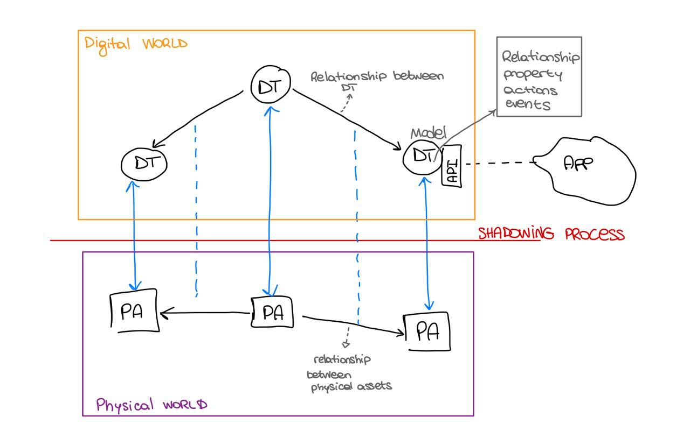
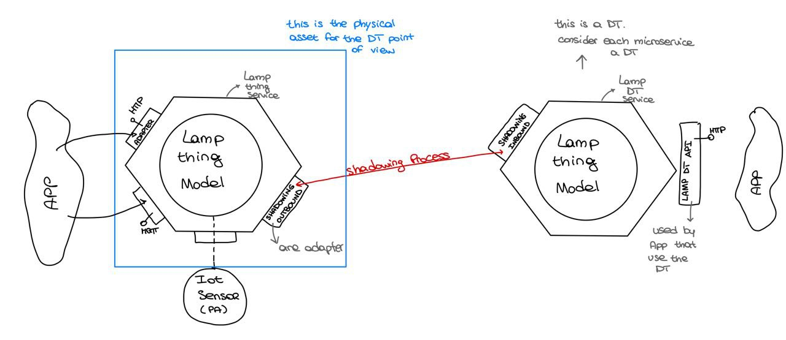

 

# activity 03 - 19/10/2022

the process of representing a real thing into a digital tween is called **shadowing**. it enable to assign to the digital tween an API to the application.

the digital tween typically has a model that is updated by the shadowing.

the model should not be so complicated, it can be even very simple. it should represents all the information that are important for our domain in that moment.

the API is used also for querying the physical world. In the physical world we can have relationship between objects, even these relationship should be represented in the digital world, and in case of that they are captured they should even being updated according to the changes that are performed in the real world.

they should mirroring also the actions that can be done in the physical world, moreover the digital world can also add action that can not still being performed in the real. in this case we are augmenting the range of actions.

//DT = digital tween

//PA = physical asset

Relationship can be represented for example with RDP or tuple. They are created dynamically, and are represented as oriented edge. the orientation depends on the model that is represented. for example i can have a relation between A and B (A -> B), but not the opposite (B--> A)

PatientDT <---- trasporta --- AmbulanceDT

PatientDT ---- è trasportato da ---> AmbulanceDT, this relation can be added if it was necessary as information

Moreover for a physical asset we can have multiple DT.

when I make predictions using digital tween, the prediction is made at the application layer, so for example even a warning is shown in the application layer.

it is also possible to have a cognitive digital tween which allows me to have repercussions on the physical asset as well (so being able to show on the real object the prediction as well).

[quando faccio delle previsioni usando i dt, la previsione viene fatta a livello applicativo, quindi ad esempio anche un warning viene mostrato nel layer applicativo.

è possibile avere anche un cognitive digital tween il quale mi permette di avere delle ripercussioni anche sul physical asset (quindi poter mostrare anche sull'oggetto reale la previsione).]

we need a shadowing component in the PA side (what is installed in the thing, it is running on the real device and in our case we are supposing that it use the MQTT. it is just an adapter, the outbound adapter that sends information to the DT. every time that an event occurs it update the state and then send it to the DT over the MQTT channel) and one in the DT side (is an inbound adapter. it just receives messages over MQTT and according to them it performs actions, so update the DT model)

in the solution the digital tween is designed as a service

it is important consider that PA and DT has two different time.  for DT is important told the time at which operations or events occurs. a digital tween must reflect the state of the PA, logging also the time. and in case the connection is lost it needs to be informed in order to still reflect a state (State in this case is NO MORE CONNECTION)

the model of the DT is accessed by the application level through the API, but it is also accessed by the shadowing in order to update the state.

A DT is a vertical application, so it is not only a service

if a DT is linked to a PA i aspect that at the application level i can interact with it by the same language (ontology = relationship between objects and word about them) of the PA, so it must respect the domain of the PA

every time that the DT is updated it can generate new events that can not strictly linked to the PA es a warning, so these events are a result of the reasoning of the DT
