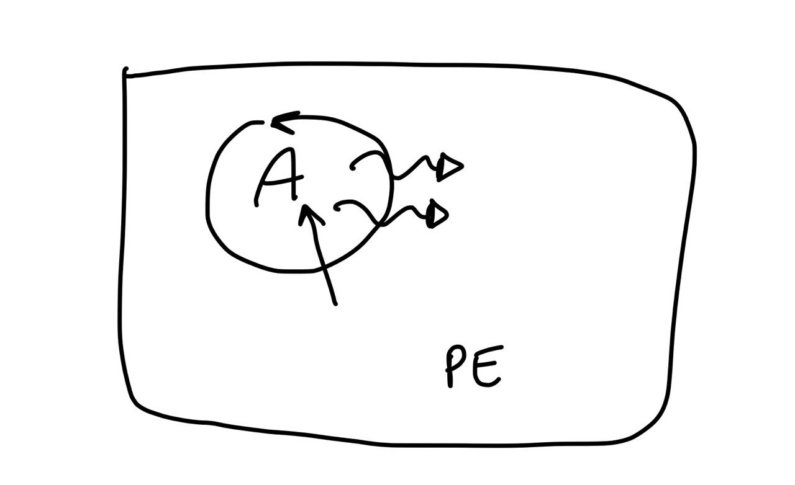
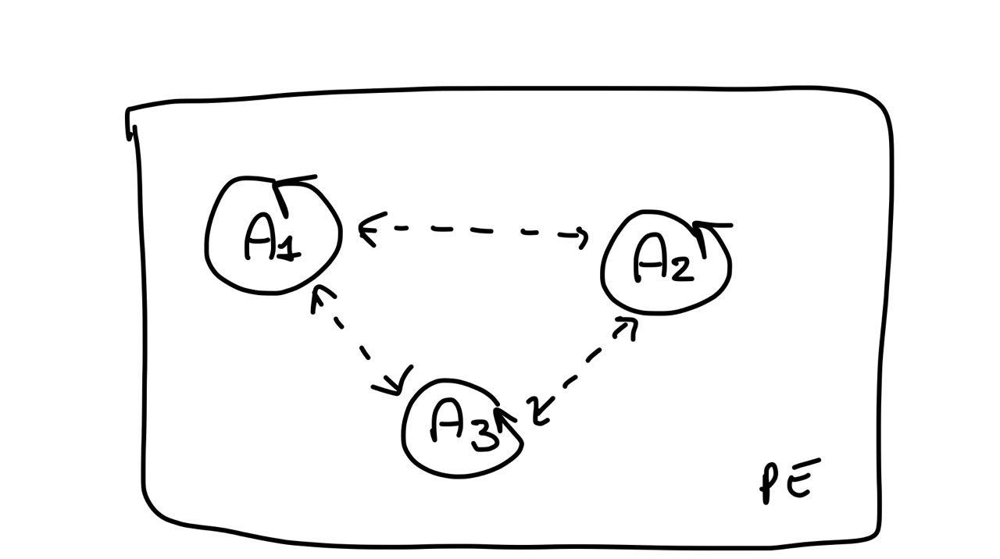
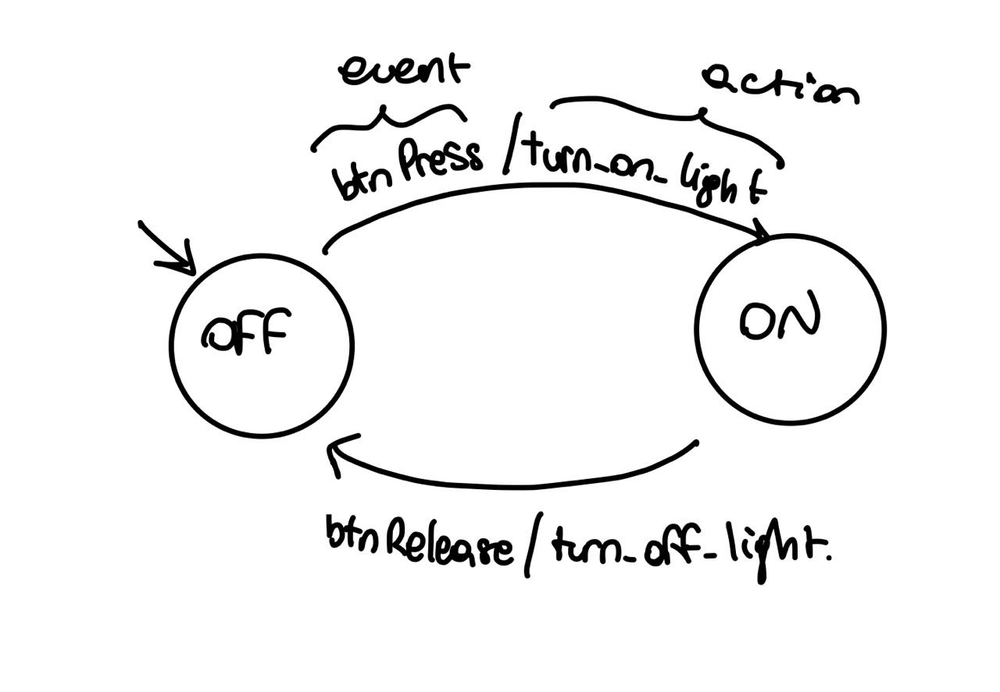
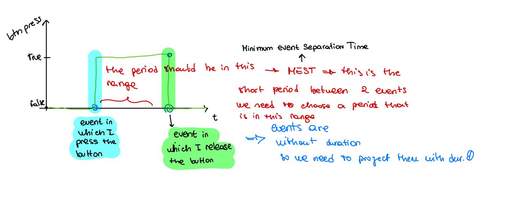

# lab 01
Reactive systems is like a cactus in which we have input and output, but also there is an interaction between systems. this interaction is a core point. The point is how to design reactive systems? remember that systems are inside an environment to which they communicate/ interact

case1 -> centralized system that is controlled from an agent. so a single sw agent that control the single system.
we have an agent that is an active component, that is proactive and reactive, because they need to react to environment event, but also create/computate events or actions

case2 -> distributed system composed by 3 subsystem, that in order to do that job must communicate. for doing that, they use a standard protocol that is MQTT.
in this case we have 3 agents that are reactive and proactive and that communicate with each other in order to perform the goal

(the idea is running 3 different applications that communicate with mqtt (for doing that install mqtt on your pc, by mosquito or vertex)

### Finite state machine

the final state machine is the way for showing the behavior of an agent, we have 2 type of FSM:
- synch -> time triggered
- async -> event triggered 

es the button led (a button and a light and simply when we press the button the light switch to on, when release it, it is turned off), the related FSM is the following:
there is also variable that condition the behavior 
actions can be specified on the transition between states
there is a single content flow (as in case 1 in which there is a single centralized agent)

in the synch case, is defined a period *p*, the event occurs every *p* period, so this is the motivation because it is called **time triggered**. In this case all depends on the time (logical clock of the system). when we use them we need to be aware about the period so this is also the problem of this systems. this because every event has a duration equals to 0, so the period need to be short enough for not loosing events, but at the same time should be as large enough for complete the operation.

we need to abstract from the duration of the computation, but at the same tame we need to consider that computation need some times, so the duration should be large enough for complete the computation. 

in this case the period is very important

in the **event triggered case we have no period**, in this case we need a mechanism in order to model the events.

FSM is a good model for specify the behavior that we want to obtain, so we can use them, but we need also to show the global behavior, but for doing that we have to stay more abstract (example in which we show the 3 agents)

the basic kind of control architecture (what should be the pattern, or the common behavior of these agents) is the **super loop architecture** (sens plan act). Is a general way for describe the general behavior of reactive systems.

in pseudocode there is an initial state in which we made a setup an then there is a loop in which we look at the system, on that we decide what to do and then we act:

SETUP

LOOP: -> this are execution cycles.
    SENS
    DECIDE WHAT TO DO (the decision must be taken on the sens of this cycle, only with atomic operation we can get this type of behavior)
    ACT

all the actions inside the loop must be atomic but at the same time they must be non blocking, because if it is blocking we are blocking the loop, so the system is no more able to sensing the system, so we decompose a task in multiple cycles, so that even if is a long computation we are not blocking the whole system.
if it is only with these instructions the pc is not reactive, for being reactive it needs interruption, interruption are performed at the end of every cycle of the loop, this leads to a event driven behavior. 
the interruption can not interrupt an action that is performing, but at the end of it the pc understand that there was an interruption, so it starts to manage it.

If I have a machine that support a super loop i need only to program what at each loop it needs to do. In the case of agents we haven't a loop, but we program that with plans that specify what to do when something occurs.

the other one is the **EVENT LOOP,** in this case our agents are programmed for managing events, where events can be everything. in this case we have:

LOOP:
    EV <-	WAIT FOR EVENT (this is the only place in which we are waiting)
    H<-SELECT HANDLER(EV)
    EXEC(H)

it can be implemented with different threads. when adopting an event loop we are perceiving the environment only through events. any kind of input generated by the environment, should be modeled in terms of events! (as in case of actors in which everything is model as message).

All the approach are independent of the state.

SUPERLOOP FSM -> in this case we said that every period of time corresponds to a clock cycle (and every cycle depends on the current state )

EVENT LOOP FSM -> we model the tick of each loop through events, in this case the handler that will be executed depends on the triggered event.

For representing an FSM in programs we use the <u>STATE DESIGN PATTERN</u>, in which there is an interface that define at high level the event an than a class for each state of the FSM. these class implements the state interface, and inside the state describe the behavior that the machine has when it is in that state, so the events that can trigger and the state in which arrives when that event is triggered.
